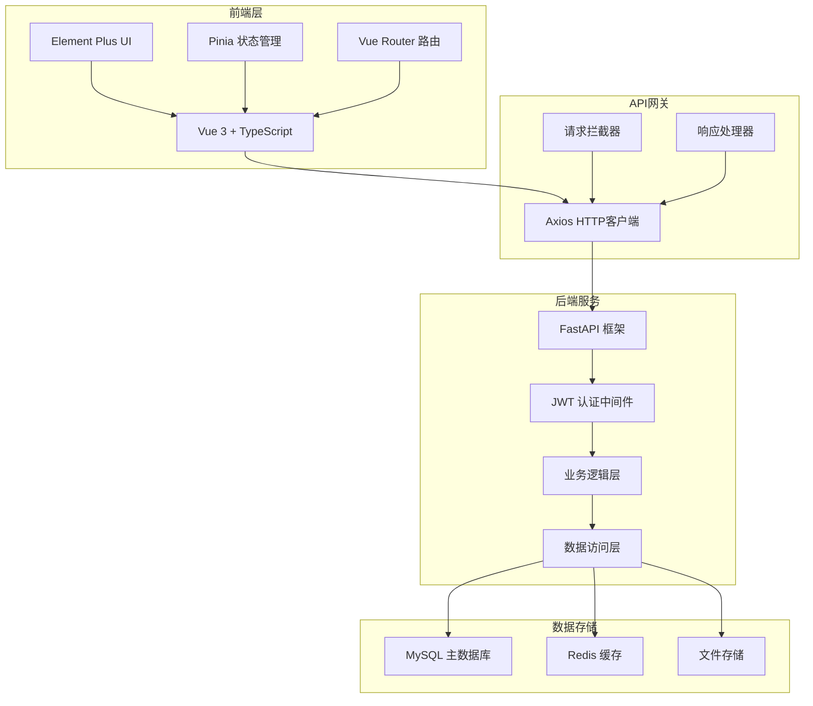
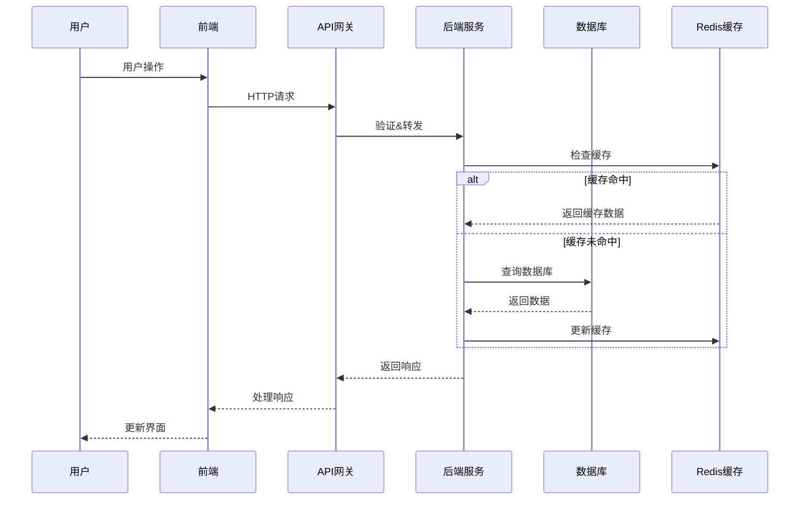

# 🏪 店铺管理系统 - 完整开发指南

## 📋 目录

### 🏗️ 系统架构
- [架构概览](#架构概览)
- [技术栈分析](#技术栈分析)
- [系统组件](#系统组件)
- [数据流设计](#数据流设计)

### 💻 开发环境
- [环境搭建](#环境搭建)
- [项目结构](#项目结构)
- [开发工具配置](#开发工具配置)
- [代码规范](#代码规范)

### 🛠️ 开发流程
- [后端开发](#后端开发)
- [前端开发](#前端开发)
- [API接口开发](#api接口开发)
- [数据库设计](#数据库设计)

### 🐛 调试指南
- [后端调试](#后端调试)
- [前端调试](#前端调试)
- [数据库调试](#数据库调试)
- [性能调试](#性能调试)

### 🧪 测试策略
- [单元测试](#单元测试)
- [集成测试](#集成测试)
- [E2E测试](#e2e测试)
- [性能测试](#性能测试)

---

## 🏗️ 系统架构

### 架构概览



### 技术栈分析

#### 前端技术栈
- **Vue 3.3.4** - 渐进式JavaScript框架
- **TypeScript 5.1.6** - 类型安全的JavaScript超集
- **Element Plus 2.3.9** - 基于Vue 3的组件库
- **Pinia 2.1.6** - Vue的现代状态管理库
- **Vue Router 4.2.4** - Vue.js官方路由管理器
- **Axios 1.4.0** - Promise基的HTTP客户端
- **ECharts 5.4.3** - 数据可视化图表库
- **Vite 4.4.6** - 现代前端构建工具

#### 后端技术栈
- **FastAPI 0.104.1** - 现代、快速的Web框架
- **SQLAlchemy 2.0.23** - Python SQL工具包和ORM
- **Pydantic 2.5.0** - 数据验证和设置管理
- **Uvicorn 0.24.0** - ASGI服务器实现
- **PyMySQL 1.1.2** - MySQL数据库连接器
- **Redis 5.0.1** - 内存数据结构存储
- **Python-jose 3.3.0** - JWT令牌处理

### 系统组件

#### 核心业务模块
1. **认证授权模块**
   - 用户登录/注册
   - JWT令牌管理
   - 权限控制

2. **店铺管理模块**
   - 多店铺支持
   - 店铺信息管理
   - 店铺权限控制

3. **商品管理模块**
   - 商品CRUD操作
   - 分类管理
   - 库存管理

4. **订单管理模块**
   - 订单创建处理
   - 订单状态跟踪
   - 支付集成

5. **会员管理模块**
   - 会员信息管理
   - 积分系统
   - 消费记录

6. **统计分析模块**
   - 销售数据统计
   - 趋势分析
   - 报表生成

### 数据流设计



---

## 💻 开发环境

### 环境搭建

#### 系统要求
- **操作系统**: Windows 10+, macOS 10.15+, Ubuntu 18.04+
- **Python**: 3.10+
- **Node.js**: 18.0+
- **MySQL**: 8.0+
- **Redis**: 6.0+

#### 快速搭建步骤

1. **克隆项目**
```bash
git clone <repository-url>
cd shop-manager
```

2. **后端环境**
```bash
cd backend-python
python -m venv venv

# Windows
venv\Scripts\activate
# macOS/Linux
source venv/bin/activate

pip install -r requirements.txt
```

3. **前端环境**
```bash
cd frontend
npm install
```

4. **数据库配置**
```bash
# 复制环境配置文件
cp backend-python/.env.example backend-python/.env

# 编辑配置文件
vim backend-python/.env
```

5. **启动服务**
```bash
# 后端服务 (端口8000)
cd backend-python
python main.py

# 前端服务 (端口3000)
cd frontend
npm run dev
```

### 项目结构

```
shop-manager/
├── 📁 backend-python/          # Python后端服务
│   ├── 📁 app/                # 应用核心代码
│   │   ├── 📁 routes/         # API路由定义
│   │   ├── 📁 middleware/     # 中间件
│   │   ├── 📁 schemas/        # Pydantic模型
│   │   └── 📁 utils/          # 工具函数
│   ├── 📄 main.py             # 应用入口
│   ├── 📄 config.py           # 配置管理
│   └── 📄 requirements.txt    # Python依赖
│
├── 📁 frontend/               # Vue3前端应用
│   ├── 📁 src/               # 源代码目录
│   │   ├── 📁 components/    # Vue组件
│   │   ├── 📁 views/         # 页面视图
│   │   ├── 📁 stores/        # Pinia状态管理
│   │   ├── 📁 router/        # 路由配置
│   │   ├── 📁 api/           # API接口封装
│   │   ├── 📁 types/         # TypeScript类型定义
│   │   └── 📁 utils/         # 工具函数
│   ├── 📄 package.json       # 前端依赖配置
│   └── 📄 vite.config.ts     # Vite构建配置
│
├── 📁 scripts/               # 脚本工具
│   ├── 📄 start-full.sh      # 一键启动脚本
│   └── 📄 status.sh          # 服务状态检查
│
├── 📁 docs/                  # 项目文档
├── 📁 logs/                  # 日志文件
└── 📄 docker-compose.yml     # Docker编排配置
```

### 开发工具配置

#### VS Code 推荐插件
```json
{
  "recommendations": [
    "vue.volar",
    "ms-python.python",
    "ms-python.black-formatter",
    "bradlc.vscode-tailwindcss",
    "esbenp.prettier-vscode",
    "ms-vscode.vscode-typescript-next"
  ]
}
```

#### 编辑器配置
```json
{
  "editor.formatOnSave": true,
  "editor.codeActionsOnSave": {
    "source.fixAll.eslint": true
  },
  "python.defaultInterpreterPath": "./backend-python/venv/bin/python",
  "python.formatting.provider": "black"
}
```

### 代码规范

#### Python代码规范 (Black + Flake8)
```python
# 示例：良好的Python代码风格
from typing import Optional, List
from fastapi import APIRouter, Depends, HTTPException
from sqlalchemy.orm import Session

router = APIRouter()

@router.get("/products", response_model=List[ProductResponse])
async def get_products(
    skip: int = 0,
    limit: int = 100,
    db: Session = Depends(get_db)
) -> List[ProductResponse]:
    """获取商品列表"""
    products = db.query(Product).offset(skip).limit(limit).all()
    return products
```

#### TypeScript/Vue代码规范
```typescript
// 示例：良好的TypeScript代码风格
interface Product {
  id: number
  name: string
  price: number
  category?: string
  createdAt: Date
}

// Vue组件示例
<script setup lang="ts">
import { ref, onMounted } from 'vue'
import type { Product } from '@/types'

const products = ref<Product[]>([])
const loading = ref(false)

const fetchProducts = async (): Promise<void> => {
  loading.value = true
  try {
    const response = await api.get<Product[]>('/products')
    products.value = response.data
  } catch (error) {
    console.error('获取商品失败:', error)
  } finally {
    loading.value = false
  }
}

onMounted(() => {
  fetchProducts()
})
</script>
```

---

## 🛠️ 开发流程

### 后端开发

#### API开发流程
1. **定义数据模型**
```python
# app/models/product.py
from sqlalchemy import Column, Integer, String, Float, DateTime
from sqlalchemy.ext.declarative import declarative_base

Base = declarative_base()

class Product(Base):
    __tablename__ = "products"
    
    id = Column(Integer, primary_key=True, index=True)
    name = Column(String(100), nullable=False)
    price = Column(Float, nullable=False)
    description = Column(String(500))
    created_at = Column(DateTime, default=datetime.utcnow)
```

2. **创建Pydantic模式**
```python
# app/schemas/product.py
from pydantic import BaseModel
from datetime import datetime
from typing import Optional

class ProductBase(BaseModel):
    name: str
    price: float
    description: Optional[str] = None

class ProductCreate(ProductBase):
    pass

class ProductResponse(ProductBase):
    id: int
    created_at: datetime
    
    class Config:
        from_attributes = True
```

3. **实现API路由**
```python
# app/routes/products.py
from fastapi import APIRouter, Depends, HTTPException
from sqlalchemy.orm import Session
from typing import List

router = APIRouter(prefix="/products", tags=["products"])

@router.post("/", response_model=ProductResponse)
async def create_product(
    product: ProductCreate,
    db: Session = Depends(get_db)
):
    db_product = Product(**product.dict())
    db.add(db_product)
    db.commit()
    db.refresh(db_product)
    return db_product
```

#### 数据库迁移
```bash
# 创建迁移文件
alembic revision --autogenerate -m "添加商品表"

# 执行迁移
alembic upgrade head

# 回滚迁移
alembic downgrade -1
```

### 前端开发

#### 组件开发流程
1. **创建类型定义**
```typescript
// src/types/product.ts
export interface Product {
  id: number
  name: string
  price: number
  description?: string
  createdAt: string
}

export interface ProductCreateForm {
  name: string
  price: number
  description?: string
}
```

2. **封装API接口**
```typescript
// src/api/products.ts
import { request } from './index'
import type { Product, ProductCreateForm } from '@/types'

export const productApi = {
  // 获取商品列表
  getProducts: (params?: { skip?: number; limit?: number }) =>
    request.get<Product[]>('/products', { params }),
  
  // 创建商品
  createProduct: (data: ProductCreateForm) =>
    request.post<Product>('/products', data),
  
  // 更新商品
  updateProduct: (id: number, data: Partial<ProductCreateForm>) =>
    request.put<Product>(`/products/${id}`, data),
  
  // 删除商品
  deleteProduct: (id: number) =>
    request.delete(`/products/${id}`)
}
```

3. **创建状态管理**
```typescript
// src/stores/products.ts
import { defineStore } from 'pinia'
import { ref, computed } from 'vue'
import { productApi } from '@/api'
import type { Product, ProductCreateForm } from '@/types'

export const useProductStore = defineStore('products', () => {
  const products = ref<Product[]>([])
  const loading = ref(false)
  
  const productCount = computed(() => products.value.length)
  
  const fetchProducts = async () => {
    loading.value = true
    try {
      const response = await productApi.getProducts()
      products.value = response.data
    } catch (error) {
      console.error('获取商品失败:', error)
    } finally {
      loading.value = false
    }
  }
  
  const createProduct = async (data: ProductCreateForm) => {
    try {
      const response = await productApi.createProduct(data)
      products.value.push(response.data)
      return response.data
    } catch (error) {
      console.error('创建商品失败:', error)
      throw error
    }
  }
  
  return {
    products,
    loading,
    productCount,
    fetchProducts,
    createProduct
  }
})
```

4. **开发Vue组件**
```vue
<!-- src/views/Products.vue -->
<template>
  <div class="products-page">
    <div class="page-header">
      <h1>商品管理</h1>
      <el-button type="primary" @click="showCreateDialog = true">
        <el-icon><Plus /></el-icon>
        新增商品
      </el-button>
    </div>
    
    <el-table :data="products" :loading="loading" stripe>
      <el-table-column prop="id" label="ID" width="80" />
      <el-table-column prop="name" label="商品名称" />
      <el-table-column prop="price" label="价格">
        <template #default="{ row }">
          ¥{{ row.price.toFixed(2) }}
        </template>
      </el-table-column>
      <el-table-column prop="description" label="描述" />
      <el-table-column label="操作" width="200">
        <template #default="{ row }">
          <el-button size="small" @click="editProduct(row)">
            编辑
          </el-button>
          <el-button 
            size="small" 
            type="danger" 
            @click="deleteProduct(row.id)"
          >
            删除
          </el-button>
        </template>
      </el-table-column>
    </el-table>
    
    <!-- 创建/编辑对话框 -->
    <ProductDialog 
      v-model="showCreateDialog"
      :product="editingProduct"
      @success="handleSuccess"
    />
  </div>
</template>

<script setup lang="ts">
import { ref, onMounted } from 'vue'
import { ElMessage, ElMessageBox } from 'element-plus'
import { Plus } from '@element-plus/icons-vue'
import { useProductStore } from '@/stores'
import ProductDialog from '@/components/ProductDialog.vue'
import type { Product } from '@/types'

const productStore = useProductStore()
const { products, loading } = storeToRefs(productStore)

const showCreateDialog = ref(false)
const editingProduct = ref<Product | null>(null)

const editProduct = (product: Product) => {
  editingProduct.value = product
  showCreateDialog.value = true
}

const deleteProduct = async (id: number) => {
  try {
    await ElMessageBox.confirm('确定要删除这个商品吗？', '确认删除', {
      type: 'warning'
    })
    // 执行删除操作
    ElMessage.success('删除成功')
  } catch (error) {
    // 用户取消
  }
}

const handleSuccess = () => {
  showCreateDialog.value = false
  editingProduct.value = null
  productStore.fetchProducts()
}

onMounted(() => {
  productStore.fetchProducts()
})
</script>
```

### API接口开发

#### RESTful API设计原则
```python
# 遵循RESTful设计原则的API路由
from fastapi import APIRouter

router = APIRouter()

# 商品相关API
@router.get("/products")              # 获取商品列表
@router.post("/products")             # 创建商品
@router.get("/products/{id}")         # 获取单个商品
@router.put("/products/{id}")         # 更新商品
@router.delete("/products/{id}")      # 删除商品

# 嵌套资源API
@router.get("/products/{id}/reviews") # 获取商品评论
@router.post("/products/{id}/reviews") # 创建商品评论
```

#### API响应格式标准化
```python
from pydantic import BaseModel
from typing import Generic, TypeVar, Optional

T = TypeVar('T')

class ApiResponse(BaseModel, Generic[T]):
    code: int = 200
    message: str = "success"
    data: Optional[T] = None
    
class PaginatedResponse(BaseModel, Generic[T]):
    items: List[T]
    total: int
    page: int
    size: int
    pages: int

# 使用示例
@router.get("/products", response_model=ApiResponse[PaginatedResponse[Product]])
async def get_products(
    page: int = 1,
    size: int = 20,
    db: Session = Depends(get_db)
):
    total = db.query(Product).count()
    products = db.query(Product).offset((page-1)*size).limit(size).all()
    
    return ApiResponse(
        data=PaginatedResponse(
            items=products,
            total=total,
            page=page,
            size=size,
            pages=(total + size - 1) // size
        )
    )
```

### 数据库设计

#### 数据库表结构设计
```sql
-- 用户表
CREATE TABLE users (
    id INT PRIMARY KEY AUTO_INCREMENT,
    username VARCHAR(50) UNIQUE NOT NULL,
    email VARCHAR(100) UNIQUE NOT NULL,
    password_hash VARCHAR(255) NOT NULL,
    role ENUM('admin', 'manager', 'staff') DEFAULT 'staff',
    is_active BOOLEAN DEFAULT TRUE,
    created_at TIMESTAMP DEFAULT CURRENT_TIMESTAMP,
    updated_at TIMESTAMP DEFAULT CURRENT_TIMESTAMP ON UPDATE CURRENT_TIMESTAMP
);

-- 店铺表
CREATE TABLE shops (
    id INT PRIMARY KEY AUTO_INCREMENT,
    name VARCHAR(100) NOT NULL,
    address TEXT,
    phone VARCHAR(20),
    owner_id INT,
    status ENUM('active', 'inactive') DEFAULT 'active',
    created_at TIMESTAMP DEFAULT CURRENT_TIMESTAMP,
    updated_at TIMESTAMP DEFAULT CURRENT_TIMESTAMP ON UPDATE CURRENT_TIMESTAMP,
    FOREIGN KEY (owner_id) REFERENCES users(id)
);

-- 商品分类表
CREATE TABLE categories (
    id INT PRIMARY KEY AUTO_INCREMENT,
    name VARCHAR(50) NOT NULL,
    parent_id INT DEFAULT NULL,
    shop_id INT NOT NULL,
    sort_order INT DEFAULT 0,
    created_at TIMESTAMP DEFAULT CURRENT_TIMESTAMP,
    FOREIGN KEY (parent_id) REFERENCES categories(id),
    FOREIGN KEY (shop_id) REFERENCES shops(id)
);

-- 商品表
CREATE TABLE products (
    id INT PRIMARY KEY AUTO_INCREMENT,
    name VARCHAR(100) NOT NULL,
    sku VARCHAR(50) UNIQUE,
    price DECIMAL(10,2) NOT NULL,
    cost_price DECIMAL(10,2),
    stock_quantity INT DEFAULT 0,
    min_stock_level INT DEFAULT 0,
    category_id INT,
    shop_id INT NOT NULL,
    description TEXT,
    image_url VARCHAR(500),
    status ENUM('active', 'inactive', 'out_of_stock') DEFAULT 'active',
    created_at TIMESTAMP DEFAULT CURRENT_TIMESTAMP,
    updated_at TIMESTAMP DEFAULT CURRENT_TIMESTAMP ON UPDATE CURRENT_TIMESTAMP,
    FOREIGN KEY (category_id) REFERENCES categories(id),
    FOREIGN KEY (shop_id) REFERENCES shops(id),
    INDEX idx_shop_category (shop_id, category_id),
    INDEX idx_sku (sku),
    INDEX idx_status (status)
);

-- 订单表
CREATE TABLE orders (
    id INT PRIMARY KEY AUTO_INCREMENT,
    order_number VARCHAR(50) UNIQUE NOT NULL,
    shop_id INT NOT NULL,
    customer_name VARCHAR(100),
    customer_phone VARCHAR(20),
    total_amount DECIMAL(10,2) NOT NULL,
    discount_amount DECIMAL(10,2) DEFAULT 0,
    final_amount DECIMAL(10,2) NOT NULL,
    payment_method ENUM('cash', 'card', 'alipay', 'wechat') DEFAULT 'cash',
    payment_status ENUM('pending', 'paid', 'refunded') DEFAULT 'pending',
    order_status ENUM('pending', 'processing', 'completed', 'cancelled') DEFAULT 'pending',
    created_by INT,
    created_at TIMESTAMP DEFAULT CURRENT_TIMESTAMP,
    updated_at TIMESTAMP DEFAULT CURRENT_TIMESTAMP ON UPDATE CURRENT_TIMESTAMP,
    FOREIGN KEY (shop_id) REFERENCES shops(id),
    FOREIGN KEY (created_by) REFERENCES users(id),
    INDEX idx_shop_status (shop_id, order_status),
    INDEX idx_order_number (order_number),
    INDEX idx_created_at (created_at)
);

-- 订单明细表
CREATE TABLE order_items (
    id INT PRIMARY KEY AUTO_INCREMENT,
    order_id INT NOT NULL,
    product_id INT NOT NULL,
    quantity INT NOT NULL,
    unit_price DECIMAL(10,2) NOT NULL,
    total_price DECIMAL(10,2) NOT NULL,
    FOREIGN KEY (order_id) REFERENCES orders(id) ON DELETE CASCADE,
    FOREIGN KEY (product_id) REFERENCES products(id),
    INDEX idx_order (order_id),
    INDEX idx_product (product_id)
);
```

---

## 🐛 调试指南

### 后端调试

#### 日志配置
```python
# config/logging.py
import logging
import sys
from pathlib import Path

def setup_logging():
    # 创建日志目录
    log_dir = Path("logs")
    log_dir.mkdir(exist_ok=True)
    
    # 配置日志格式
    formatter = logging.Formatter(
        '%(asctime)s - %(name)s - %(levelname)s - %(message)s'
    )
    
    # 文件处理器
    file_handler = logging.FileHandler(log_dir / "app.log")
    file_handler.setFormatter(formatter)
    file_handler.setLevel(logging.INFO)
    
    # 控制台处理器
    console_handler = logging.StreamHandler(sys.stdout)
    console_handler.setFormatter(formatter)
    console_handler.setLevel(logging.DEBUG)
    
    # 根日志器配置
    root_logger = logging.getLogger()
    root_logger.setLevel(logging.DEBUG)
    root_logger.addHandler(file_handler)
    root_logger.addHandler(console_handler)

# 使用示例
import logging

logger = logging.getLogger(__name__)

@router.post("/products")
async def create_product(product: ProductCreate, db: Session = Depends(get_db)):
    logger.info(f"创建商品请求: {product.dict()}")
    try:
        # 业务逻辑
        db_product = Product(**product.dict())
        db.add(db_product)
        db.commit()
        logger.info(f"商品创建成功: ID={db_product.id}")
        return db_product
    except Exception as e:
        logger.error(f"创建商品失败: {str(e)}")
        db.rollback()
        raise HTTPException(status_code=400, detail=str(e))
```

#### 性能监控
```python
import time
from functools import wraps

def monitor_performance(func):
    @wraps(func)
    async def wrapper(*args, **kwargs):
        start_time = time.time()
        try:
            result = await func(*args, **kwargs)
            execution_time = time.time() - start_time
            logger.info(f"{func.__name__} 执行时间: {execution_time:.2f}s")
            return result
        except Exception as e:
            execution_time = time.time() - start_time
            logger.error(f"{func.__name__} 执行失败 (耗时: {execution_time:.2f}s): {str(e)}")
            raise
    return wrapper

# 使用装饰器
@monitor_performance
async def get_products(db: Session = Depends(get_db)):
    return db.query(Product).all()
```

#### 数据库查询调试
```python
# 启用SQLAlchemy查询日志
import logging
logging.getLogger('sqlalchemy.engine').setLevel(logging.INFO)

# 查询分析工具
from sqlalchemy import text

def analyze_query_performance(db: Session, query_sql: str):
    # 执行EXPLAIN分析
    result = db.execute(text(f"EXPLAIN ANALYZE {query_sql}"))
    for row in result:
        logger.info(f"查询分析: {row}")

# 慢查询监控
from sqlalchemy.pool import StaticPool
from sqlalchemy.engine import create_engine

engine = create_engine(
    DATABASE_URL,
    echo=True,  # 打印所有SQL语句
    echo_pool=True,  # 打印连接池信息
)
```

### 前端调试

#### Vue DevTools配置
```typescript
// main.ts
import { createApp } from 'vue'
import App from './App.vue'

const app = createApp(App)

// 开发环境配置
if (import.meta.env.DEV) {
  app.config.performance = true
  app.config.devtools = true
}

app.mount('#app')
```

#### 请求响应拦截器调试
```typescript
// api/index.ts
import axios from 'axios'

const request = axios.create({
  baseURL: import.meta.env.VITE_API_URL,
  timeout: 10000,
})

// 请求拦截器
request.interceptors.request.use(
  (config) => {
    console.group(`🚀 ${config.method?.toUpperCase()} ${config.url}`)
    console.log('请求配置:', config)
    console.log('请求数据:', config.data)
    console.groupEnd()
    return config
  },
  (error) => {
    console.error('请求错误:', error)
    return Promise.reject(error)
  }
)

// 响应拦截器
request.interceptors.response.use(
  (response) => {
    console.group(`✅ ${response.config.method?.toUpperCase()} ${response.config.url}`)
    console.log('响应状态:', response.status)
    console.log('响应数据:', response.data)
    console.log('响应时间:', Date.now() - response.config.metadata?.startTime)
    console.groupEnd()
    return response
  },
  (error) => {
    console.group(`❌ ${error.config?.method?.toUpperCase()} ${error.config?.url}`)
    console.error('响应错误:', error.response?.data || error.message)
    console.error('错误状态:', error.response?.status)
    console.groupEnd()
    return Promise.reject(error)
  }
)
```

#### 状态管理调试
```typescript
// stores/index.ts
import { createPinia } from 'pinia'

const pinia = createPinia()

// 开发环境状态调试
if (import.meta.env.DEV) {
  pinia.use(({ store }) => {
    store.$subscribe((mutation, state) => {
      console.group(`🔄 Store: ${store.$id}`)
      console.log('Mutation:', mutation)
      console.log('New State:', state)
      console.groupEnd()
    })
  })
}

export default pinia
```

### 数据库调试

#### 慢查询监控
```sql
-- 启用慢查询日志
SET GLOBAL slow_query_log = 'ON';
SET GLOBAL slow_query_log_file = '/var/log/mysql/slow.log';
SET GLOBAL long_query_time = 2;

-- 查看慢查询状态
SHOW VARIABLES LIKE 'slow_query%';
SHOW VARIABLES LIKE 'long_query_time';

-- 分析慢查询
SHOW PROCESSLIST;
SELECT * FROM information_schema.PROCESSLIST WHERE TIME > 10;
```

#### 索引分析
```sql
-- 检查表的索引使用情况
EXPLAIN SELECT * FROM products WHERE shop_id = 1 AND status = 'active';

-- 查看索引统计信息
SELECT 
    TABLE_NAME,
    INDEX_NAME,
    CARDINALITY,
    SUB_PART,
    PACKED,
    NULLABLE,
    INDEX_TYPE
FROM information_schema.STATISTICS 
WHERE TABLE_SCHEMA = 'shop_manager';

-- 查找未使用的索引
SELECT 
    s.TABLE_SCHEMA,
    s.TABLE_NAME,
    s.INDEX_NAME,
    s.CARDINALITY
FROM information_schema.STATISTICS s
LEFT JOIN performance_schema.table_io_waits_summary_by_index_usage t 
    ON s.TABLE_SCHEMA = t.OBJECT_SCHEMA 
    AND s.TABLE_NAME = t.OBJECT_NAME 
    AND s.INDEX_NAME = t.INDEX_NAME
WHERE t.INDEX_NAME IS NULL 
    AND s.TABLE_SCHEMA = 'shop_manager'
    AND s.INDEX_NAME != 'PRIMARY';
```

### 性能调试

#### 前端性能监控
```typescript
// utils/performance.ts
class PerformanceMonitor {
  private static instance: PerformanceMonitor
  
  static getInstance(): PerformanceMonitor {
    if (!PerformanceMonitor.instance) {
      PerformanceMonitor.instance = new PerformanceMonitor()
    }
    return PerformanceMonitor.instance
  }
  
  // 监控页面加载性能
  measurePageLoad(): void {
    window.addEventListener('load', () => {
      const perfData = performance.getEntriesByType('navigation')[0] as PerformanceNavigationTiming
      
      console.group('📊 页面性能指标')
      console.log(`DNS查询: ${perfData.domainLookupEnd - perfData.domainLookupStart}ms`)
      console.log(`TCP连接: ${perfData.connectEnd - perfData.connectStart}ms`)
      console.log(`请求响应: ${perfData.responseEnd - perfData.requestStart}ms`)
      console.log(`DOM解析: ${perfData.domContentLoadedEventEnd - perfData.responseEnd}ms`)
      console.log(`页面加载: ${perfData.loadEventEnd - perfData.navigationStart}ms`)
      console.groupEnd()
    })
  }
  
  // 监控API请求性能
  measureApiRequest(url: string, startTime: number): void {
    const duration = performance.now() - startTime
    
    if (duration > 1000) {
      console.warn(`⚠️ 慢API请求: ${url} (${duration.toFixed(2)}ms)`)
    } else {
      console.log(`✅ API请求: ${url} (${duration.toFixed(2)}ms)`)
    }
  }
  
  // 监控组件渲染性能
  measureComponentRender(componentName: string, renderFn: () => void): void {
    const startTime = performance.now()
    renderFn()
    const endTime = performance.now()
    
    console.log(`🎨 组件渲染: ${componentName} (${(endTime - startTime).toFixed(2)}ms)`)
  }
}

// 使用示例
const perfMonitor = PerformanceMonitor.getInstance()
perfMonitor.measurePageLoad()
```

#### 后端性能分析
```python
import cProfile
import pstats
import io
from functools import wraps

def profile_performance(func):
    @wraps(func)
    def wrapper(*args, **kwargs):
        pr = cProfile.Profile()
        pr.enable()
        
        result = func(*args, **kwargs)
        
        pr.disable()
        s = io.StringIO()
        ps = pstats.Stats(pr, stream=s).sort_stats('cumulative')
        ps.print_stats()
        
        logger.info(f"性能分析 - {func.__name__}:")
        logger.info(s.getvalue())
        
        return result
    return wrapper

# 内存使用监控
import psutil
import os

def log_memory_usage():
    process = psutil.Process(os.getpid())
    memory_info = process.memory_info()
    logger.info(f"内存使用: {memory_info.rss / 1024 / 1024:.2f} MB")

# 数据库连接池监控
from sqlalchemy.pool import QueuePool

def monitor_connection_pool(engine):
    pool = engine.pool
    logger.info(f"连接池状态: "
                f"大小={pool.size()}, "
                f"已检出={pool.checkedout()}, "
                f"已连接={pool.checkedin()}, "
                f"无效连接={pool.invalidated()}")
```

---

## 🧪 测试策略

### 单元测试

#### 后端单元测试 (pytest)
```python
# tests/test_product_service.py
import pytest
from fastapi.testclient import TestClient
from sqlalchemy import create_engine
from sqlalchemy.orm import sessionmaker

from app.main import app
from app.database import Base, get_db
from app.models.product import Product

# 测试数据库配置
SQLALCHEMY_DATABASE_URL = "sqlite:///./test.db"
engine = create_engine(SQLALCHEMY_DATABASE_URL, connect_args={"check_same_thread": False})
TestingSessionLocal = sessionmaker(autocommit=False, autoflush=False, bind=engine)

Base.metadata.create_all(bind=engine)

def override_get_db():
    try:
        db = TestingSessionLocal()
        yield db
    finally:
        db.close()

app.dependency_overrides[get_db] = override_get_db
client = TestClient(app)

class TestProductAPI:
    def setup_method(self):
        """每个测试方法执行前的设置"""
        Base.metadata.drop_all(bind=engine)
        Base.metadata.create_all(bind=engine)
    
    def test_create_product(self):
        """测试创建商品"""
        product_data = {
            "name": "测试商品",
            "price": 99.99,
            "description": "这是一个测试商品"
        }
        
        response = client.post("/products", json=product_data)
        
        assert response.status_code == 200
        data = response.json()
        assert data["name"] == product_data["name"]
        assert data["price"] == product_data["price"]
        assert "id" in data
    
    def test_get_products(self):
        """测试获取商品列表"""
        # 先创建一些测试数据
        for i in range(3):
            client.post("/products", json={
                "name": f"商品{i}",
                "price": 10.0 + i,
                "description": f"描述{i}"
            })
        
        response = client.get("/products")
        
        assert response.status_code == 200
        data = response.json()
        assert len(data) == 3
    
    def test_get_product_by_id(self):
        """测试根据ID获取商品"""
        # 创建商品
        create_response = client.post("/products", json={
            "name": "测试商品",
            "price": 99.99
        })
        product_id = create_response.json()["id"]
        
        # 获取商品
        response = client.get(f"/products/{product_id}")
        
        assert response.status_code == 200
        data = response.json()
        assert data["id"] == product_id
        assert data["name"] == "测试商品"
    
    def test_update_product(self):
        """测试更新商品"""
        # 创建商品
        create_response = client.post("/products", json={
            "name": "原始商品",
            "price": 50.0
        })
        product_id = create_response.json()["id"]
        
        # 更新商品
        update_data = {
            "name": "更新后的商品",
            "price": 75.0
        }
        response = client.put(f"/products/{product_id}", json=update_data)
        
        assert response.status_code == 200
        data = response.json()
        assert data["name"] == update_data["name"]
        assert data["price"] == update_data["price"]
    
    def test_delete_product(self):
        """测试删除商品"""
        # 创建商品
        create_response = client.post("/products", json={
            "name": "待删除商品",
            "price": 30.0
        })
        product_id = create_response.json()["id"]
        
        # 删除商品
        response = client.delete(f"/products/{product_id}")
        assert response.status_code == 200
        
        # 验证商品已删除
        get_response = client.get(f"/products/{product_id}")
        assert get_response.status_code == 404

# 运行测试
# pytest tests/test_product_service.py -v
```

#### 前端单元测试 (Vitest + Vue Test Utils)
```typescript
// tests/components/ProductList.test.ts
import { describe, it, expect, vi, beforeEach } from 'vitest'
import { mount } from '@vue/test-utils'
import { createPinia, setActivePinia } from 'pinia'
import ProductList from '@/components/ProductList.vue'
import { useProductStore } from '@/stores/products'

// 模拟API
vi.mock('@/api/products', () => ({
  productApi: {
    getProducts: vi.fn(() => Promise.resolve({
      data: [
        { id: 1, name: '商品1', price: 99.99, description: '描述1' },
        { id: 2, name: '商品2', price: 199.99, description: '描述2' }
      ]
    }))
  }
}))

describe('ProductList', () => {
  beforeEach(() => {
    setActivePinia(createPinia())
  })

  it('应该正确渲染商品列表', async () => {
    const wrapper = mount(ProductList)
    
    // 等待异步数据加载
    await wrapper.vm.$nextTick()
    await new Promise(resolve => setTimeout(resolve, 100))
    
    // 验证商品列表渲染
    const productItems = wrapper.findAll('.product-item')
    expect(productItems).toHaveLength(2)
    
    // 验证商品信息显示
    expect(wrapper.text()).toContain('商品1')
    expect(wrapper.text()).toContain('¥99.99')
  })

  it('应该正确处理加载状态', async () => {
    const wrapper = mount(ProductList)
    
    // 验证加载状态
    expect(wrapper.find('.loading').exists()).toBe(true)
    
    // 等待加载完成
    await wrapper.vm.$nextTick()
    await new Promise(resolve => setTimeout(resolve, 100))
    
    // 验证加载状态消失
    expect(wrapper.find('.loading').exists()).toBe(false)
  })

  it('应该正确处理商品删除', async () => {
    const wrapper = mount(ProductList)
    await wrapper.vm.$nextTick()
    
    // 模拟删除按钮点击
    const deleteButton = wrapper.find('.delete-btn')
    await deleteButton.trigger('click')
    
    // 验证删除确认对话框
    expect(wrapper.emitted('delete')).toBeTruthy()
  })
})

// 测试Store
describe('ProductStore', () => {
  beforeEach(() => {
    setActivePinia(createPinia())
  })

  it('应该正确获取商品列表', async () => {
    const store = useProductStore()
    
    await store.fetchProducts()
    
    expect(store.products).toHaveLength(2)
    expect(store.products[0].name).toBe('商品1')
    expect(store.loading).toBe(false)
  })

  it('应该正确计算商品数量', () => {
    const store = useProductStore()
    store.products = [
      { id: 1, name: '商品1', price: 99.99 },
      { id: 2, name: '商品2', price: 199.99 }
    ]
    
    expect(store.productCount).toBe(2)
  })
})
```

### 集成测试

#### API集成测试
```python
# tests/test_integration.py
import pytest
from fastapi.testclient import TestClient
from app.main import app

client = TestClient(app)

class TestProductIntegration:
    def test_product_workflow(self):
        """测试完整的商品管理流程"""
        
        # 1. 创建商品
        create_data = {
            "name": "集成测试商品",
            "price": 199.99,
            "description": "集成测试描述"
        }
        create_response = client.post("/products", json=create_data)
        assert create_response.status_code == 200
        product_id = create_response.json()["id"]
        
        # 2. 获取商品详情
        get_response = client.get(f"/products/{product_id}")
        assert get_response.status_code == 200
        product_data = get_response.json()
        assert product_data["name"] == create_data["name"]
        
        # 3. 更新商品
        update_data = {"name": "更新后的商品", "price": 299.99}
        update_response = client.put(f"/products/{product_id}", json=update_data)
        assert update_response.status_code == 200
        
        # 4. 验证更新
        get_updated_response = client.get(f"/products/{product_id}")
        updated_product = get_updated_response.json()
        assert updated_product["name"] == update_data["name"]
        assert updated_product["price"] == update_data["price"]
        
        # 5. 删除商品
        delete_response = client.delete(f"/products/{product_id}")
        assert delete_response.status_code == 200
        
        # 6. 验证删除
        get_deleted_response = client.get(f"/products/{product_id}")
        assert get_deleted_response.status_code == 404

    def test_order_creation_workflow(self):
        """测试订单创建流程"""
        
        # 1. 先创建商品
        product_data = {"name": "订单测试商品", "price": 50.0}
        product_response = client.post("/products", json=product_data)
        product_id = product_response.json()["id"]
        
        # 2. 创建订单
        order_data = {
            "customer_name": "测试客户",
            "customer_phone": "13800138000",
            "items": [
                {"product_id": product_id, "quantity": 2, "unit_price": 50.0}
            ]
        }
        order_response = client.post("/orders", json=order_data)
        assert order_response.status_code == 200
        
        order = order_response.json()
        assert order["customer_name"] == order_data["customer_name"]
        assert order["total_amount"] == 100.0  # 2 * 50.0
        
        # 3. 获取订单详情
        order_id = order["id"]
        get_order_response = client.get(f"/orders/{order_id}")
        assert get_order_response.status_code == 200
        
        order_detail = get_order_response.json()
        assert len(order_detail["items"]) == 1
        assert order_detail["items"][0]["product_id"] == product_id
```

#### 前端集成测试
```typescript
// tests/integration/ProductManagement.test.ts
import { describe, it, expect, beforeEach, afterEach } from 'vitest'
import { mount } from '@vue/test-utils'
import { createPinia, setActivePinia } from 'pinia'
import { createRouter, createWebHistory } from 'vue-router'
import ProductManagement from '@/views/ProductManagement.vue'

describe('ProductManagement Integration', () => {
  let wrapper: any
  let router: any

  beforeEach(async () => {
    setActivePinia(createPinia())
    
    router = createRouter({
      history: createWebHistory(),
      routes: [
        { path: '/products', component: ProductManagement }
      ]
    })
    
    wrapper = mount(ProductManagement, {
      global: {
        plugins: [router]
      }
    })
    
    await router.isReady()
  })

  afterEach(() => {
    wrapper.unmount()
  })

  it('应该完成完整的商品管理流程', async () => {
    // 1. 验证页面初始化
    expect(wrapper.find('h1').text()).toBe('商品管理')
    
    // 2. 打开创建对话框
    const createBtn = wrapper.find('.create-btn')
    await createBtn.trigger('click')
    
    expect(wrapper.find('.product-dialog').isVisible()).toBe(true)
    
    // 3. 填写表单
    const nameInput = wrapper.find('input[placeholder="商品名称"]')
    const priceInput = wrapper.find('input[placeholder="价格"]')
    
    await nameInput.setValue('测试商品')
    await priceInput.setValue('99.99')
    
    // 4. 提交表单
    const submitBtn = wrapper.find('.submit-btn')
    await submitBtn.trigger('click')
    
    // 5. 等待异步操作完成
    await wrapper.vm.$nextTick()
    
    // 6. 验证商品已添加到列表
    expect(wrapper.text()).toContain('测试商品')
    expect(wrapper.text()).toContain('¥99.99')
  })
})
```

### E2E测试

#### Playwright E2E测试
```typescript
// tests/e2e/product-management.spec.ts
import { test, expect } from '@playwright/test'

test.describe('商品管理', () => {
  test.beforeEach(async ({ page }) => {
    // 登录系统
    await page.goto('/login')
    await page.fill('input[name="username"]', 'admin')
    await page.fill('input[name="password"]', 'password')
    await page.click('button[type="submit"]')
    
    // 等待登录完成并跳转到商品管理页面
    await page.waitForURL('/dashboard')
    await page.click('text=商品管理')
    await page.waitForURL('/products')
  })

  test('应该能够创建新商品', async ({ page }) => {
    // 点击新增商品按钮
    await page.click('text=新增商品')
    
    // 填写商品信息
    await page.fill('input[placeholder="商品名称"]', 'E2E测试商品')
    await page.fill('input[placeholder="价格"]', '199.99')
    await page.fill('textarea[placeholder="商品描述"]', '这是一个E2E测试商品')
    
    // 提交表单
    await page.click('button:has-text("确认")')
    
    // 验证商品已添加
    await expect(page.locator('text=E2E测试商品')).toBeVisible()
    await expect(page.locator('text=¥199.99')).toBeVisible()
  })

  test('应该能够编辑商品', async ({ page }) => {
    // 假设已有商品，点击编辑按钮
    await page.click('.product-row:first-child .edit-btn')
    
    // 修改商品信息
    await page.fill('input[placeholder="商品名称"]', '编辑后的商品名称')
    await page.fill('input[placeholder="价格"]', '299.99')
    
    // 保存修改
    await page.click('button:has-text("保存")')
    
    // 验证修改生效
    await expect(page.locator('text=编辑后的商品名称')).toBeVisible()
    await expect(page.locator('text=¥299.99')).toBeVisible()
  })

  test('应该能够删除商品', async ({ page }) => {
    // 获取删除前的商品数量
    const initialCount = await page.locator('.product-row').count()
    
    // 点击删除按钮
    await page.click('.product-row:first-child .delete-btn')
    
    // 确认删除
    await page.click('button:has-text("确定")')
    
    // 验证商品已删除
    const finalCount = await page.locator('.product-row').count()
    expect(finalCount).toBe(initialCount - 1)
  })

  test('应该能够搜索商品', async ({ page }) => {
    // 在搜索框中输入关键词
    await page.fill('input[placeholder="搜索商品"]', '测试')
    await page.press('input[placeholder="搜索商品"]', 'Enter')
    
    // 验证搜索结果
    const productRows = page.locator('.product-row')
    const count = await productRows.count()
    
    // 验证所有显示的商品都包含搜索关键词
    for (let i = 0; i < count; i++) {
      const productName = await productRows.nth(i).locator('.product-name').textContent()
      expect(productName).toContain('测试')
    }
  })
})
```

### 性能测试

#### 后端性能测试 (Locust)
```python
# tests/performance/locustfile.py
from locust import HttpUser, task, between
import json
import random

class ShopManagerUser(HttpUser):
    wait_time = between(1, 3)  # 用户操作间隔1-3秒
    
    def on_start(self):
        """测试开始前的初始化"""
        # 登录获取token
        response = self.client.post("/auth/login", json={
            "username": "admin",
            "password": "password"
        })
        
        if response.status_code == 200:
            self.token = response.json()["access_token"]
            self.client.headers.update({
                "Authorization": f"Bearer {self.token}"
            })
    
    @task(3)
    def get_products(self):
        """获取商品列表 - 高频操作"""
        self.client.get("/products")
    
    @task(2)
    def get_product_detail(self):
        """获取商品详情 - 中频操作"""
        product_id = random.randint(1, 100)
        self.client.get(f"/products/{product_id}")
    
    @task(1)
    def create_product(self):
        """创建商品 - 低频操作"""
        product_data = {
            "name": f"性能测试商品{random.randint(1, 1000)}",
            "price": round(random.uniform(10, 500), 2),
            "description": "性能测试商品描述"
        }
        self.client.post("/products", json=product_data)
    
    @task(2)
    def get_orders(self):
        """获取订单列表"""
        self.client.get("/orders")
    
    @task(1)
    def create_order(self):
        """创建订单"""
        order_data = {
            "customer_name": f"测试客户{random.randint(1, 100)}",
            "customer_phone": f"138{random.randint(10000000, 99999999)}",
            "items": [
                {
                    "product_id": random.randint(1, 50),
                    "quantity": random.randint(1, 5),
                    "unit_price": round(random.uniform(10, 200), 2)
                }
            ]
        }
        self.client.post("/orders", json=order_data)

# 运行性能测试
# locust -f tests/performance/locustfile.py --host=http://localhost:8000
```

#### 前端性能测试
```typescript
// tests/performance/frontend-performance.ts
import { test, expect } from '@playwright/test'

test.describe('前端性能测试', () => {
  test('页面加载性能', async ({ page }) => {
    // 开始性能监控
    await page.goto('/products', { waitUntil: 'networkidle' })
    
    // 获取性能指标
    const performanceMetrics = await page.evaluate(() => {
      const perfData = performance.getEntriesByType('navigation')[0] as PerformanceNavigationTiming
      return {
        domContentLoaded: perfData.domContentLoadedEventEnd - perfData.navigationStart,
        loadComplete: perfData.loadEventEnd - perfData.navigationStart,
        firstPaint: performance.getEntriesByName('first-paint')[0]?.startTime || 0,
        firstContentfulPaint: performance.getEntriesByName('first-contentful-paint')[0]?.startTime || 0
      }
    })
    
    // 性能断言
    expect(performanceMetrics.domContentLoaded).toBeLessThan(2000) // DOM加载应在2秒内
    expect(performanceMetrics.loadComplete).toBeLessThan(3000) // 页面完全加载应在3秒内
    expect(performanceMetrics.firstContentfulPaint).toBeLessThan(1500) // 首次内容绘制应在1.5秒内
    
    console.log('性能指标:', performanceMetrics)
  })

  test('大量数据渲染性能', async ({ page }) => {
    // 模拟大量商品数据
    await page.goto('/products')
    
    // 测量列表渲染时间
    const startTime = Date.now()
    
    // 等待大量数据加载完成
    await page.waitForSelector('.product-row', { timeout: 10000 })
    await page.waitForFunction(() => {
      const rows = document.querySelectorAll('.product-row')
      return rows.length >= 100 // 等待至少100行数据
    })
    
    const endTime = Date.now()
    const renderTime = endTime - startTime
    
    // 渲染时间应在合理范围内
    expect(renderTime).toBeLessThan(5000) // 5秒内完成渲染
    
    console.log(`渲染${await page.locator('.product-row').count()}条数据耗时: ${renderTime}ms`)
  })

  test('内存泄漏检测', async ({ page }) => {
    await page.goto('/products')
    
    // 获取初始内存使用
    const initialMemory = await page.evaluate(() => {
      return (performance as any).memory?.usedJSHeapSize || 0
    })
    
    // 执行多次页面操作
    for (let i = 0; i < 10; i++) {
      await page.click('text=刷新')
      await page.waitForTimeout(1000)
    }
    
    // 获取操作后内存使用
    const finalMemory = await page.evaluate(() => {
      return (performance as any).memory?.usedJSHeapSize || 0
    })
    
    const memoryIncrease = finalMemory - initialMemory
    const memoryIncreasePercent = (memoryIncrease / initialMemory) * 100
    
    // 内存增长不应超过50%
    expect(memoryIncreasePercent).toBeLessThan(50)
    
    console.log(`内存使用变化: ${memoryIncrease} bytes (${memoryIncreasePercent.toFixed(2)}%)`)
  })
})
```

## 📈 持续集成与部署

### GitHub Actions CI/CD
```yaml
# .github/workflows/ci-cd.yml
name: CI/CD Pipeline

on:
  push:
    branches: [ main, develop ]
  pull_request:
    branches: [ main ]

jobs:
  test-backend:
    runs-on: ubuntu-latest
    
    services:
      mysql:
        image: mysql:8.0
        env:
          MYSQL_ROOT_PASSWORD: testpassword
          MYSQL_DATABASE: shop_manager_test
        ports:
          - 3306:3306
        options: --health-cmd="mysqladmin ping" --health-interval=10s --health-timeout=5s --health-retries=3
      
      redis:
        image: redis:6.0
        ports:
          - 6379:6379
    
    steps:
    - uses: actions/checkout@v3
    
    - name: Set up Python
      uses: actions/setup-python@v4
      with:
        python-version: '3.10'
    
    - name: Install dependencies
      run: |
        cd backend-python
        pip install -r requirements.txt
        pip install pytest pytest-asyncio pytest-cov
    
    - name: Run tests
      run: |
        cd backend-python
        pytest tests/ -v --cov=app --cov-report=xml
    
    - name: Upload coverage
      uses: codecov/codecov-action@v3
      with:
        file: ./backend-python/coverage.xml

  test-frontend:
    runs-on: ubuntu-latest
    
    steps:
    - uses: actions/checkout@v3
    
    - name: Set up Node.js
      uses: actions/setup-node@v3
      with:
        node-version: '18'
        cache: 'npm'
        cache-dependency-path: frontend/package-lock.json
    
    - name: Install dependencies
      run: |
        cd frontend
        npm ci
    
    - name: Run linting
      run: |
        cd frontend
        npm run lint
    
    - name: Run unit tests
      run: |
        cd frontend
        npm run test:unit
    
    - name: Build application
      run: |
        cd frontend
        npm run build

  e2e-tests:
    runs-on: ubuntu-latest
    needs: [test-backend, test-frontend]
    
    steps:
    - uses: actions/checkout@v3
    
    - name: Set up Node.js
      uses: actions/setup-node@v3
      with:
        node-version: '18'
    
    - name: Install Playwright
      run: |
        cd frontend
        npm ci
        npx playwright install
    
    - name: Start services
      run: |
        # 启动后端和前端服务
        ./scripts/start-full.sh &
        sleep 30  # 等待服务启动
    
    - name: Run E2E tests
      run: |
        cd frontend
        npx playwright test
    
    - name: Upload test results
      uses: actions/upload-artifact@v3
      if: always()
      with:
        name: playwright-report
        path: frontend/playwright-report/

  deploy:
    runs-on: ubuntu-latest
    needs: [test-backend, test-frontend, e2e-tests]
    if: github.ref == 'refs/heads/main'
    
    steps:
    - uses: actions/checkout@v3
    
    - name: Deploy to production
      run: |
        echo "部署到生产环境"
        # 这里添加实际的部署脚本
```

这个完整的开发指南涵盖了店铺管理系统的各个方面，包括架构设计、开发流程、调试方法和测试策略。您可以根据具体需求调整和扩展这些内容。

需要我详细解释某个特定部分，或者添加其他内容吗？